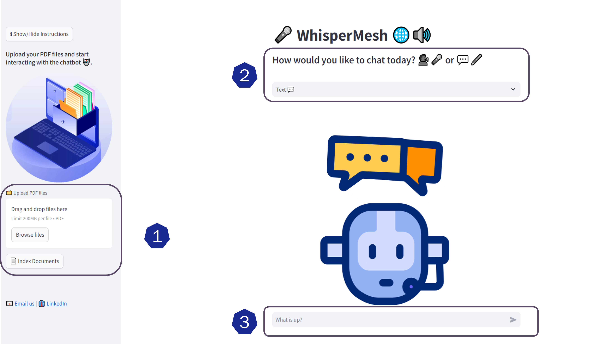

# WhisperMesh 🌐🔊
WhisperMesh is your cutting-edge chatbot that seamlessly blends voice and text interactions, creating a rich, intuitive conversational experience. With the power of LLM models and a sophisticated vector database, WhisperMesh understands your needs like never before, providing tailored responses that resonate with your queries.

Harnessing the RAG framework from Haystack, our app excels in extracting relevant information, ensuring that every interaction is not only engaging but also data-driven. Whether you prefer speaking or typing, WhisperMesh adapts to your style, transforming your input into insightful answers with a personal touch.

Join the conversation with WhisperMesh, where your voice matters, and let us guide you through a world of knowledge and discovery! 🌟💬✨
# 🎯 Key Features of WhisperMesh

### 1. Seamless Voice and Text Interactions
WhisperMesh offers a cutting-edge conversational experience by blending voice and text inputs, allowing you to communicate in the way that suits you best.

### 2. Advanced LLM Integration
Powered by state-of-the-art large language models (LLMs), WhisperMesh understands your needs deeply and provides tailored responses that resonate with your queries.

###  3. Intelligent Vector Database
Utilizing *Qdrant* as our vector database, WhisperMesh efficiently manages and retrieves relevant information, ensuring data-driven interactions that enhance user engagement.

###  4. Cohere Embedding Model
Our application harnesses the Cohere embedding model for effective semantic understanding, ensuring that every interaction is insightful and contextually aware.

### 5. Robust Speech-to-Text Capabilities
With the *Whisper-large-v3* model from Groq Cloud, WhisperMesh excels at converting speech to text, making voice interactions smooth and accurate.

### 6. Generative Model for Personalized Responses
Employing the *Mixtral-8x7b* model from Groq Cloud, our app generates personalized responses, adding a unique touch to every conversation.
 
### 7. RAG Framework for Data-Driven Insights
Harnessing the RAG (Retrieval-Augmented Generation) framework from *Haystack*, WhisperMesh excels in extracting relevant information, ensuring that your interactions are engaging and informative.

# 🛠️ How it Works
### 📄 Step 1: Upload Your PDF Documents and Index Them
- **Upload Options:** Drag and drop your files or click on **'Browse Files'** to select them. (Maximum file size: **200MB**).
- **Start Indexing:** Click the **'📄 Index Document'** button to initiate the indexing process.

### ⚙️ Step 2: Choose Your Chat Method
- Decide whether you prefer to chat via **text** or **voice**.

### 💬 Step 3: Ask Your Questions
- **Text Input:** Use the text box below to type your question. 📝
- **Voice Input:** Click the **🎙️ microphone icon** to ask questions using your voice.



# 🚀 Getting Started
### Prerequisites
* Python 3.11 or above 🐍
* Groq API for inference, which is currently available for free in its beta version with rate limits. You can obtain your API key here after creating an account: [Groq API](https://medium.com/r/?url=https%3A%2F%2Fconsole.groq.com%2Fkeys).
* Additionally, you have the option to use Qdrant either locally or via Qdrant Cloud. Its API is also free to use. Access it here: [Qdrant Cloud](https://medium.com/r/?url=https%3A%2F%2Fcloud.qdrant.io%2Flogin).
* For embeddings, you can use the Cohere API. It offers a free tier and you can sign up and get your API key here: [Cohere API](https://medium.com/r/?url=https%3A%2F%2Fcohere.ai).
# 💻 Local Deployment
### 1. Clone the Repository
```bash
git clone https://github.com/Mouez-Yazidi/WhisperMesh.git
cd WhisperMesh
```
### 2. Add Environment Variables

* Create a `.env` file and add the following variables according to the credentials you obtained from the required platforms:

    ```plaintext
    COHERE_API_KEY=
    GROQ_API=
    GROQ_KEY=
    QDRANT_API=
    QDRANT_KEY=
    ```
    
### 3. Install Dependencies
Navigate to the local directory and install the necessary dependencies:
```bash
cd local
pip install -r requirements.txt
```

### 4. Running the App Locally
To run the app locally, execute the following command:

```bash
streamlit run ../app/main.py --environment local
```
You should now be able to access the app at http://localhost:8501 🌐.

### 🐳 Optional: Running with Docker
If you prefer running the app in a Docker container, follow these steps:
1. Make sure you have Docker installed 🐋.
2. Build the Docker image:
```bash
docker build -t WhisperMesh .
```
3. Run the container:
```bash
docker run -p 8501:8501 WhisperMesh
```
# ☁️ Streamlit Cloud Deployment
### 1. Prepare Your Repository
Ensure that your code is pushed to a GitHub repository 📂.

### 2. Link with Streamlit Cloud
* Visit Streamlit Cloud and sign in.
* Connect your GitHub repository 🔗.
* Choose your repository and branch.

### 3. Environment Variables
* Go to the "Advanced settings" section of your app.
* In the "Secrets" section, input any sensitive information, such as API keys or other credentials.
* Make sure to add this variables according to the credentials you obtained from the required platforms.
```csharp
COHERE_API_KEY=""
GROQ_API=""
GROQ_KEY=""
QDRANT_API=""
QDRANT_KEY=""
```
Streamlit Cloud will:
* Install dependencies from cloud/requirements.txt 📦

🎉 You’re all set! Your app will now be live on Streamlit Cloud!

# 🌟 Features
* Configurable: Separate configuration files for local and cloud deployment.
* Docker Support: Deploy the app using Docker for local containerization.

# ✨ Show Your Support!
If you appreciate this project, we would be grateful if you could give it a star on GitHub. Your support motivates us to enhance and expand our work!

# 📄 License
This project is licensed under the MIT License. See the LICENSE file for more details.

# 📧 Contact
If you have any questions or suggestions, feel free to open an issue or contact us at mouez.yazidi2016@gmail.com.
